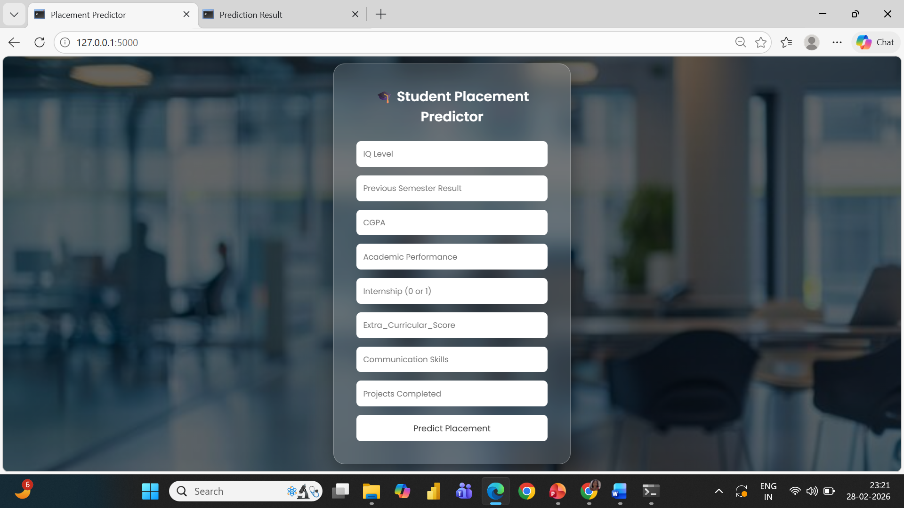
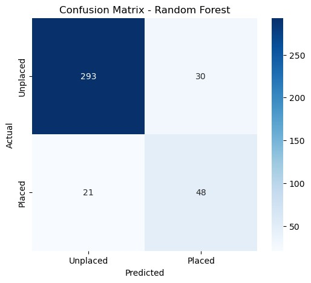
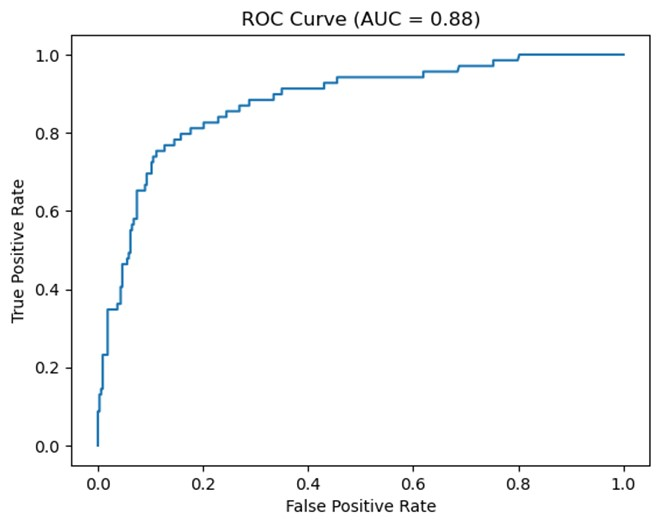

# 🎓  College Placement Prediction using Machine Learning

This project predicts whether a student will be **placed or not placed** using Machine Learning.
The model analyzes student academic performance and other related features to make predictions about placement outcomes.

---

## 📌 Project Description

This project predicts whether a student will be placed or not using Machine Learning techniques. 
The model analyzes student academic performance, internship experience, communication skills, and other related features to predict placement outcomes.

---
## 📊 Project Workflow

Data Collection  
Data Preprocessing  
Feature Engineering  
Train-Test Split  
Model Training using Random Forest  
Model Evaluation  
Prediction using Flask Web Application
---

## 🛠 Technologies Used

Python  
NumPy  
Pandas  
Matplotlib  
Seaborn  
Scikit-learn  
Flask

---

## 🤖 Machine Learning Algorithm

Random Forest Classifier was used for classification because it reduces overfitting and provides high accuracy on structured datasets.

---

## 📊 Model Evaluation

The model was evaluated using the following metrics:

* Accuracy Score
* Confusion Matrix
* ROC Curve

These metrics help measure how well the model predicts student placement.

---

## 📈 Model Performance

The Random Forest model achieved **87% accuracy** on the test dataset.

### Classification Report

| Class          | Precision | Recall | F1-Score | Support |
| -------------- | --------- | ------ | -------- | ------- |
| 0 (Not Placed) | 0.93      | 0.91   | 0.92     | 323     |
| 1 (Placed)     | 0.62      | 0.70   | 0.65     | 69      |

### Overall Metrics

* **Accuracy:** 0.87
* **Macro Average F1 Score:** 0.79
* **Weighted Average F1 Score:** 0.87

### Training vs Testing Accuracy

* **Training Accuracy:** 97.63%
* **Testing Accuracy:** 86.99%

---

## 📷 Screenshots

### User Interface

### Confusion Matrix

### ROC Curve

---

## 📁 Project Files

* `placement_prediction.ipynb` – Machine learning model training
* `college_student_placement_dataset.csv` – Dataset used for training
* `RandomForestFinal.pkl` – Saved trained model
* `app.py` – Flask application for prediction
* `requirements.txt` – Python libraries used

---

## 📚 Key Learnings

* Built a complete Machine Learning pipeline from data preprocessing to model evaluation.
* Learned feature engineering techniques to improve model performance.
* Understood classification metrics such as accuracy, precision, recall, and F1-score.
* Developed a Flask-based web interface for real-time prediction.

---

## 🚀 Future Improvements

* Improve model accuracy with more training data
* Try advanced machine learning algorithms
* Deploy the project on a cloud platform

---

